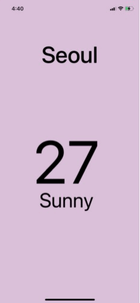

# MyWeather

노마드 코더의 [왕초보를 위한 React Native 101](https://nomadcoders.co/react-native-for-beginners/lobby)를 보고 따라하는 날씨 앱

## 목차

1. [Styles](#1.-Styles)
1. [ScrollView](#2.-ScrollView)

## 1. Styels

{: width="480"}

```javascript
import React from "react";
import { StyleSheet, Text, View } from 'react-native';

export default function App() {
  return (
    <View style={styles.container}>
      <View style={styles.city}>
        <Text style={styles.cityName}>Seoul</Text>
      </View>
      <View style={styles.weather}>
        <View style={styles.day}>
          <Text style={styles.temp}>27</Text>
          <Text style={styles.description}>Sunny</Text>
        </View>
      </View>
    </View>
  );
}

const styles = StyleSheet.create({
  container: {
    flex: 1,
    backgroundColor: "thistle",
  },
  city: {
    flex: 1.2,
    justifyContent: "center",
    alignItems: "center",
  },
  cityName: {
    fontSize: 68,
    fontWeight: "500",
  },
  weather: {
    flex: 3,
  },
  day: {
    flex: 1,
    alignItems: "center",
  },
  temp: {
    marginTop: 50,
    fontSize: 178,
  },
  description: {
    marginTop: -30,
    fontSize: 60,
  },
});
```

- React Native는 정의된 컴포넌트만 사용이 가능하다.
  - View: 일반적인 컨텐츠(div, article, section ...)
  - Text: 텍스트 컨텐츠(p, h1, h2 ...)
- 크기를 조절할 때 `flex`속성을 사용하면 편리하다.
- 기본적으로 `flexDirection`은 column이다.

## 2. ScrollView

native는 여러개의 컴포넌트를 쌓아두면 자동으로 스크롤이 생기지 않는다. 이를 위해서 `ScrollView` 컴포넌트를 사용해야 한다.

```javascript
import { Dimensions ... } from "react-native";

const { width: SCREEN_WIDTH } = Dimensions.get("window");

export default function App() {
  return (
      
    ...
      
      <ScrollView
      	contentContainerStyle={styles.weather}
        horizontal
        pagingEnabled
        showsHorizontalScrollIndicator={false}
      >
        <View style={styles.day}> ... </View>
        <View style={styles.day}> ... </View>
        <View style={styles.day}> ... </View>
        <View style={styles.day}> ... </View>
      </ScrollView>

    ...
    
  );
}

const styles = StyleSheet.create({

    ...
    
  weather: {},
  day: {
    width: SCREEN_WIDTH,
    alignItems: "center",
  },
    
    ...
    
});
```

{: width="480"}

- ScrollView는 기본적으로 column을 기준으로 한다.
  - 이를 바꾸기 위해 props로 `horizontal`을 추가한다.
- ScrollView의 스타일을 지정하기 위해 `contentContainerStyle` props를 사용한다.
- ScrollVIew의 스크롤 범위를 지정하기 위해 `pagingEnabled` props를 사용한다.
- ScrollVIew 하단의 페이지 표시줄을 지우기 위해 `showsHorizontalScrollIndicator` props를 사용한다.
- ScrollView를 사용했기 때문에 기존에 지정해 두었던 `flex` 속성이 작동하지 않는다.
  - `weather`와 `day`의 `flex` 속성을 지우자.
  - `day`의 width를 지정하기 위해 `Dimensions` API를 사용해 전체 너비를 가져오자.
