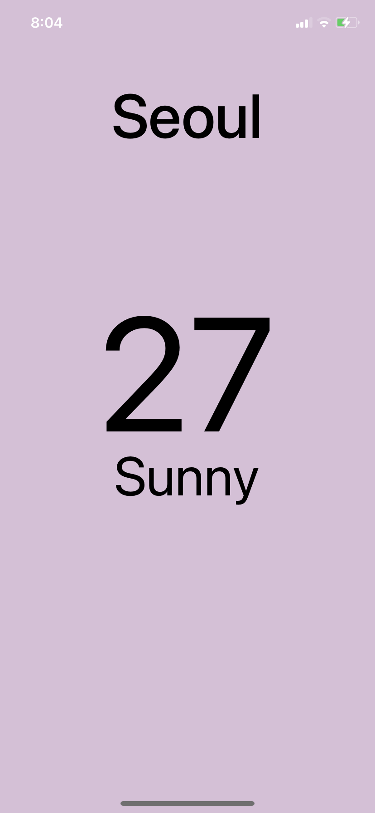

# MyWeather

노마드 코더의 [왕초보를 위한 React Native 101](https://nomadcoders.co/react-native-for-beginners/lobby)를 보고 따라하는 날씨 앱

## 목차

1. Styles

## 1. Styels



```javascript
import React from "react";
import { StyleSheet, Text, View } from 'react-native';

export default function App() {
  return (
    <View style={styles.container}>
      <View style={styles.city}>
        <Text style={styles.cityName}>Seoul</Text>
      </View>
      <View style={styles.weather}>
        <View style={styles.day}>
          <Text style={styles.temp}>27</Text>
          <Text style={styles.description}>Sunny</Text>
        </View>
      </View>
    </View>
  );
}

const styles = StyleSheet.create({
  container: {
    flex: 1,
    backgroundColor: "thistle",
  },
  city: {
    flex: 1.2,
    justifyContent: "center",
    alignItems: "center",
  },
  cityName: {
    fontSize: 68,
    fontWeight: "500",
  },
  weather: {
    flex: 3,
  },
  day: {
    flex: 1,
    alignItems: "center",
  },
  temp: {
    marginTop: 50,
    fontSize: 178,
  },
  description: {
    marginTop: -30,
    fontSize: 60,
  },
});
```

- React Native는 정의된 컴포넌트만 사용이 가능하다.
  - View: 일반적인 컨텐츠(div, article, section ...)
  - Text: 텍스트 컨텐츠(p, h1, h2 ...)
- 크기를 조절할 때 `flex`속성을 사용하면 편리하다.
- 기본적으로 `flexDirection`은 column이다.

